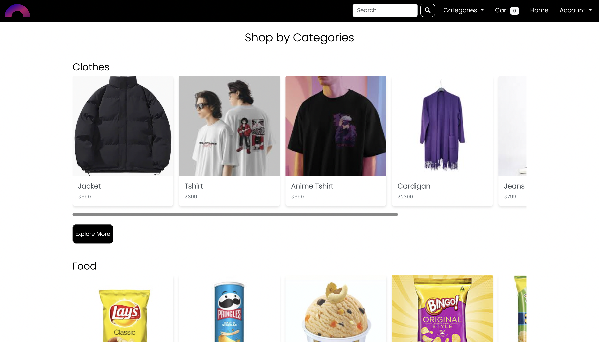
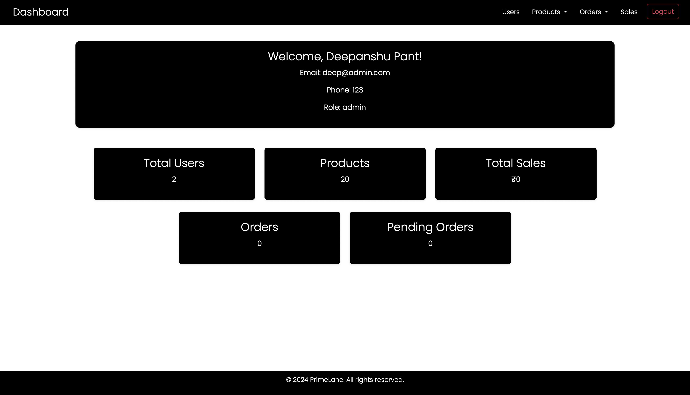
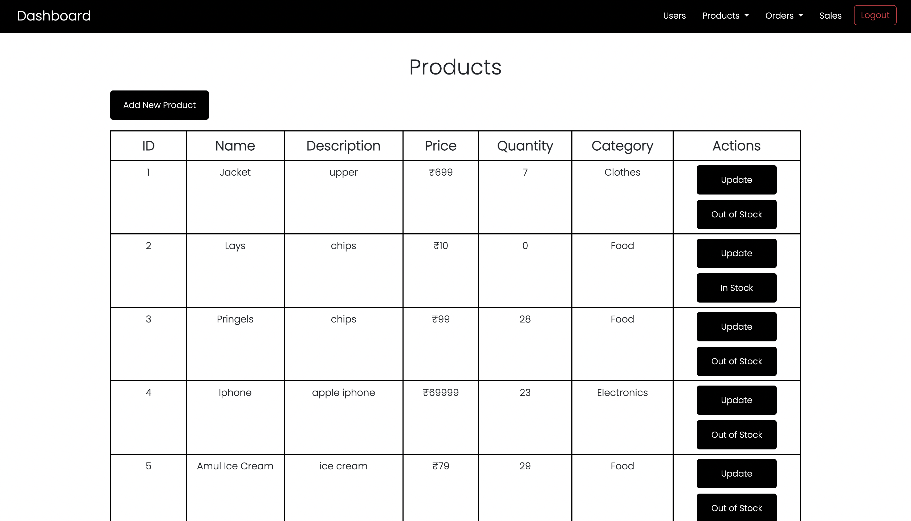
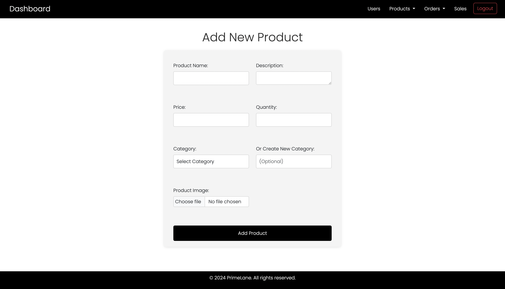

# E-Commerce Website - Capstone Project


## Overview
PrimeLane is an e-commerce platform built for my capstone project at Fynd Academy. This responsive website allows users to browse and purchase items, manage their profiles, and perform checkout with a dummy payment page on all devices. Admin can manage products, view orders, and interact with customers through a dashboard. The project is built using Flask, SQLAlchemy (SQLite), Seaborn, Matplotlib, HTML, CSS, Bootstrap, JavaScript, and REST APIs.

The app is structured using **Flask Blueprints** for modularity:
- **`auth` Blueprint:** Handles user authentication (login, signup, logout).
- **`main` Blueprint:** Manages general user features (browsing, cart, checkout, etc.).
- **`admin` Blueprint:** Provides the admin interface to manage products, orders, and users.

  
## Features

### User Features:
- **Search Products:** Users can search for products by name or category.
- **Product Management:** Users can add products to their cart and proceed with checkout.
- **Profile Management:** Users can create, view, and edit their profile.
- **Order Details:** Users can view their past orders and order statuses.
- **Login/Logout:** Users can log in and log out of the website.
- **New Account Creation:** Users can register new accounts with email validation.
- **Checkout:** Users can proceed with a checkout and view the dummy payment page.
- **Email Notifications:** Users receive an order confirmation email upon order confirmation.
- **Order History:** Users can view the history of their orders in an order history page.
- **Password Hashing:** User passwords are securely hashed using Werkzeug.
  

### Admin Features:
- **Admin Access:** Only users with an `@admin.com` email can access the admin dashboard (e.g., `deep@admin.com` you can also register with `@admin` in your email and you'll get the `Admin` role).
- **Product Management:** Admins can add, view, and update products in the store.
- **Order Management:** Admins can view all orders, manage pending orders, and view order details.
- **User Management:** Admins can activate or deactivate user accounts and view the total number of users.
- **Order Analytics:** Visual representation of top 5 products based on sales.


## Tech Stack
- **Frontend:** HTML, CSS, Bootstrap, JavaScript
- **Backend:** Flask (Python)
- **Database:** SQLAlchemy (SQLite)
- **Visualization:** Seaborn, Matplotlib
- **APIs:** REST APIs for seamless communication between frontend and backend.


## Screenshots

### Homepage



### Search Results


### Admin Dashboard


### All Products


### Adding New Products



## Installation

1. Clone the repository:
   ```bash
   git clone https://github.com/deepansh-you/Capstone-Project-Fynd.git

2. Navigate to the project directory:
   ```bash
   cd Capstone-Project-Fynd

3. Install dependencies:
   ```bash
   pip install -r requirements.txt

4. Run the Flask application:
   ```bash
   python app.py

5. Access the website locally at: http://127.0.0.1:5000/

## Acknowledgments

- Thanks to the Fynd Academy for providing the resources and guidance for this project.
- Inspiration and resources from various open-source projects and tutorials.


## Project Live Link

You can access the live version of the website here: [PrimeLane](https://deepanshyou.pythonanywhere.com/)
